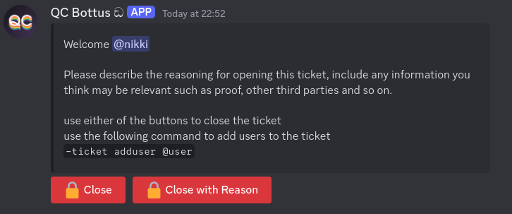

# YAGPDB Ticket Buttons
Simple buttons for opening and closing tickets for the YAGPDB Discord bot.

## [The panel for creating tickets](ticket_creation_panel.md)


## [The panel for closing tickets](ticket_closing_buttons.md)



## Extra Goodies
This will be seperated into another repo at some point.

### Command for opening a ticket for another person
This command will open a ticket for another user. It requires the user to mention the user they are opening. Even though the bot deletes the message immediately, the mentioned user will still be pinged if they have access to the channel.

`trigger type: command`

```go
{{ $username := index .Args 1 }}
{{ $member := getMember $username }}
{{ $user := $member.User }}

{{ deleteMessage nil .Message.ID 0}}

{{ if not $user }}
	{{ sendMessage nil "Couldn't find member!" }}
	{{ return }}
{{ end }}

{{ $ticket := createTicket $user (printf "ticket-%s" $user) }}

{{ sendMessageNoEscape $ticket.ChannelID (printf "This ticket has been opened for you by %s.\n Please wait for them to explain why." .Message.Author.Mention) }}
```
