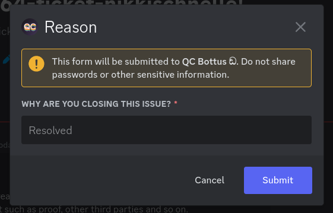

# Ticket Settings
In order to edit the message that YAGPDB sends when a ticket is opened, you need to go to:
`Tools & Utilities > Ticket System`

Inside the `Opening message in new tickets` box, you need to create the buttons used for closing the ticket.  
e.g.:
```go
{{ $button := cbutton "label" "Close" "emoji" (sdict "name" "🔒") "custom_id" "buttons-closeticket" "style" "danger" }}
{{ $buttonReason := cbutton "label" "Close with Reason" "emoji" (sdict "name" "🔒") "custom_id" "buttons-reason-closeticket" "style" "danger" }}

{{$embed := cembed `description` (joinStr `` `Welcome ` .User.Mention `

Please describe the reasoning for opening this ticket, include any information you think may be relevant such as proof, other third parties and so on.` 
"\n\nuse either of the buttons to close the ticket\n"
"use the following command to add users to the ticket\n"
"`-ticket adduser @user`")}}

{{ $message := complexMessage 
  "embed" $embed
  "buttons" (cslice $button $buttonReason)
 }}

{{sendMessage nil $message}}
```


This will create a panel with two buttons, one for closing the ticket and one for closing the ticket with a reason:


# Button: Close Ticket
This is the command that will be executed when the `Close` button is clicked. It's quite simple.

> [!IMPORTANT]  
> The `Component Custom ID Regex` needs to be the same as in the panel creation command. In this case, it is `buttons-closeticket`.

`trigger type: Message Component`

```go
{{ exec "ticket close" }}
```

# Button: Close Ticket with Reason
This is the command that will be executed when the `Close with Reason` button is clicked. It's a bit more complex, as it requires the user to provide a reason for closing the ticket. A modal is opened using this command.



> [!IMPORTANT]  
> The `Component Custom ID Regex` needs to be the same as in the panel creation command. In this case, it is `buttons-reason-closeticket`.

`trigger type: Message Component`

```go
{{ $modal := sdict
  "title" "Reason"
  "custom_id" "modals-reason-ticketclose"
  "fields" (cslice
    (sdict "label" "Why are you closing this issue?" "placeholder" "Resolved" "required" true)
	) 
 }}

{{ sendModal $modal }}
```

# Modal: Reason for Closing Ticket
This is the command that will be executed when the user submits the reason for closing the ticket. It will close the ticket and log the reason provided by the user.

> [!IMPORTANT]  
> The `Component Custom ID Regex` needs to be the same as in the panel creation command. In this case, it is `modals-reason-ticketclose`.

`trigger type: Modal Submission`

```go
{{ if .ExecData }}
	{{ exec "ticket close" .ExecData }}
	{{ return }}
{{ end }}

{{ $reason := ( index .Values 0 ) }}
{{ ephemeralResponse }}
{{ printf "Closing; Reason: %s" $reason }}
{{ execCC .CCID nil 0 $reason }}
```
