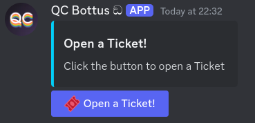
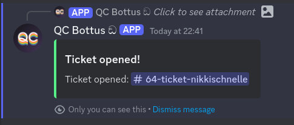

# Panel Creation
Command to create the ticket-creation panel.  
We use the `ticketbutton` as the command. If you enter `!ticketbutton` (with `!` as the prefix), the bot will create a panel with a button that users can click to open a ticket.



`trigger type: Command`

```go
{{ deleteMessage nil .Message.ID 0}}

{{ $button := cbutton "label" "Open a Ticket!" "emoji" (sdict "name" "🎟️") "custom_id" "buttons-openticket"}}

{{$embed := cembed
  "title" "Open a Ticket!"
  "description" "Click the button to open a Ticket"
  "color" 0x02cef7
}}

{{ $message := complexMessage 
  "embed" $embed
  "buttons" $button 
 }}

{{ sendMessage nil $message }}
```

# Panel Interaction
This is called by a user clicking the button in the panel.  
It responds with an ephemeral message to the user who clicked the button, informing them that the ticket has been opened:



> [!IMPORTANT]  
> The `Component Custom ID Regex` needs to be the same as in the panel creation command. In this case, it is `buttons-openticket`.

`trigger type: Message Component`

```go
{{ $token := .Interaction.Token }}
{{ $messageAuthor := .Interaction.Member.User }}

{{ $ticket := createTicket $messageAuthor (printf "ticket-%s" $messageAuthor) }}
{{ $embed := cembed
  "title" "Ticket opened!"
  "description" (printf "Ticket opened: <#%d>" $ticket.ChannelID)
  "color" 5763719
  "ephemeral" true
}}

{{ $message := complexMessage
  "embed" $embed
  "ephemeral" true
}}

{{ sendResponse $token $message }}
```
